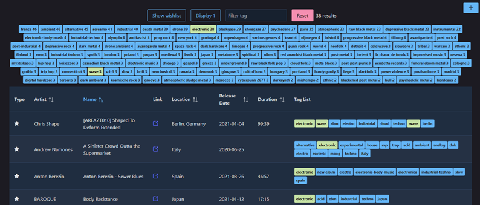

# Bandcamp Collection Manager

Import bandcamp collection and wishlist in a database, allowing to search by tag.

## Usage

Require java 21+ to run and maven to build.

Build using `mvn package`
Run using `java -jar target/bc-manager-0.0.1.jar `
Open a web browser on http://localhost:7070/
More information on parameterization in console.

## Development

Stack:
Backend: Javalin + ORMLite + H2
Frontend: React + Vite + PrimeReact

Require JDK 21+ and Node 24.

Start backend by running fr.fonkisoft.bcmanager.JavalinServer
Start front end by running `npm install` then `npm run dev` in src/main/app folder.